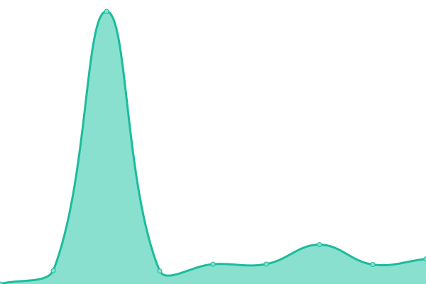

# [📈 Live Status](https://demo.upptime.js.org): <!--live status--> **🟧 Partial outage**

This repository contains the open-source uptime monitor and status page for [eatyourselfnow](https://demo.upptime.js.org), powered by [Upptime](https://github.com/upptime/upptime).

With [Upptime](https://upptime.js.org), you can get your own unlimited and free uptime monitor and status page, powered entirely by a GitHub repository. We use [Issues](https://github.com/eatyourselfnow/BlueSiteStatus/issues) as incident reports, [Actions](https://github.com/eatyourselfnow/BlueSiteStatus/actions) as uptime monitors, and [Pages](https://demo.upptime.js.org) for the status page.

<!--start: status pages-->
<!-- This summary is generated by Upptime (https://github.com/upptime/upptime) -->
<!-- Do not edit this manually, your changes will be overwritten -->
<!-- prettier-ignore -->
| URL | Status | History | Response Time | Uptime |
| --- | ------ | ------- | ------------- | ------ |
|  [Google](https://www.google.com) | 🟩 Up | [google.yml](https://github.com/BlueDude0/BlueSiteStatus/commits/HEAD/history/google.yml) | 

 120ms
     
 | 

<a href="https://BlueDude0.github.io/BlueSiteStatus/history/google">100.00%</a>
    

|  [Quad9 DNS](9.9.9.9) | 🟩 Up | [quad9-dns.yml](https://github.com/BlueDude0/BlueSiteStatus/commits/HEAD/history/quad9-dns.yml) | 

 5ms
     
 | 

<a href="https://BlueDude0.github.io/BlueSiteStatus/history/quad9-dns">100.00%</a>
    

|  [hosted-Blue Choice SC](https://www.bluechoicesc.com) | 🟩 Up | [hosted-blue-choice-sc.yml](https://github.com/BlueDude0/BlueSiteStatus/commits/HEAD/history/hosted-blue-choice-sc.yml) | 

 899ms
     
 | 

<a href="https://BlueDude0.github.io/BlueSiteStatus/history/hosted-blue-choice-sc">100.00%</a>
    

|  [hosted-PalmettoGBA](https://palmettogba.com/) | 🟥 Down | [hosted-palmetto-gba.yml](https://github.com/BlueDude0/BlueSiteStatus/commits/HEAD/history/hosted-palmetto-gba.yml) | 

 214ms
     
 | 

<a href="https://BlueDude0.github.io/BlueSiteStatus/history/hosted-palmetto-gba">96.84%</a>
    

|  [MedVPN](https://cmsvirtualoffice.bcbssc.com/) | 🟩 Up | [med-vpn.yml](https://github.com/BlueDude0/BlueSiteStatus/commits/HEAD/history/med-vpn.yml) | 

 245ms
     
 | 

<a href="https://BlueDude0.github.io/BlueSiteStatus/history/med-vpn">100.00%</a>
    

|  [TriVPN](https://pgbavirtualoffice.bcbssc.com/) | 🟥 Down | [tri-vpn.yml](https://github.com/BlueDude0/BlueSiteStatus/commits/HEAD/history/tri-vpn.yml) | 

 0ms
     
 | 

<a href="https://BlueDude0.github.io/BlueSiteStatus/history/tri-vpn">0.00%</a>
    

|  [MyE-Work](https://www.mye-work.com/) | 🟥 Down | [my-e-work.yml](https://github.com/BlueDude0/BlueSiteStatus/commits/HEAD/history/my-e-work.yml) | 

 0ms
     
 | 

<a href="https://BlueDude0.github.io/BlueSiteStatus/history/my-e-work">0.00%</a>
    

|  [My Health Toolkit](https://www.myhealthtoolkit.com/) | 🟩 Up | [my-health-toolkit.yml](https://github.com/BlueDude0/BlueSiteStatus/commits/HEAD/history/my-health-toolkit.yml) | 

 242ms
     
 | 

<a href="https://BlueDude0.github.io/BlueSiteStatus/history/my-health-toolkit">100.00%</a>
    

|  [CrpVPN](https://vpn.bcbssc.com/) | 🟥 Down | [crp-vpn.yml](https://github.com/BlueDude0/BlueSiteStatus/commits/HEAD/history/crp-vpn.yml) | 

 0ms
     
 | 

<a href="https://BlueDude0.github.io/BlueSiteStatus/history/crp-vpn">0.00%</a>
    

|  [Member](member.bcbssc.com/) | 🟥 Down | [member.yml](https://github.com/BlueDude0/BlueSiteStatus/commits/HEAD/history/member.yml) | 

 0ms
     
 | 

<a href="https://BlueDude0.github.io/BlueSiteStatus/history/member">0.00%</a>
    

|  [SouthCarolinaBlues](https://www.southcarolinablues.com/) | 🟩 Up | [south-carolina-blues.yml](https://github.com/BlueDude0/BlueSiteStatus/commits/HEAD/history/south-carolina-blues.yml) | 

 347ms
     
 | 

<a href="https://BlueDude0.github.io/BlueSiteStatus/history/south-carolina-blues">100.00%</a>
    

|  [ComRemote](https://comremote.bcbssc.com/vpn/index.html) | 🟩 Up | [com-remote.yml](https://github.com/BlueDude0/BlueSiteStatus/commits/HEAD/history/com-remote.yml) | 

 334ms
     
 | 

<a href="https://BlueDude0.github.io/BlueSiteStatus/history/com-remote">100.00%</a>
    

|  [DMECompetitiveBid](https://dmecompetitivebid.com/) | 🟩 Up | [dme-competitive-bid.yml](https://github.com/BlueDude0/BlueSiteStatus/commits/HEAD/history/dme-competitive-bid.yml) | 

 321ms
     
 | 

<a href="https://BlueDude0.github.io/BlueSiteStatus/history/dme-competitive-bid">97.09%</a>
    

|  [DRComRemote](https://drcomremote.bcbssc.com/) | 🟥 Down | [dr-com-remote.yml](https://github.com/BlueDude0/BlueSiteStatus/commits/HEAD/history/dr-com-remote.yml) | 

 0ms
     
 | 

<a href="https://BlueDude0.github.io/BlueSiteStatus/history/dr-com-remote">0.00%</a>
    

|  [DRTriRemote](https://drtriremote.bcbssc.com/) | 🟥 Down | [dr-tri-remote.yml](https://github.com/BlueDude0/BlueSiteStatus/commits/HEAD/history/dr-tri-remote.yml) | 

 0ms
     
 | 

<a href="https://BlueDude0.github.io/BlueSiteStatus/history/dr-tri-remote">0.00%</a>
    

|  [DRMedRemote](https://drmedremote.bcbssc.com/) | 🟥 Down | [dr-med-remote.yml](https://github.com/BlueDude0/BlueSiteStatus/commits/HEAD/history/dr-med-remote.yml) | 

 0ms
     
 | 

<a href="https://BlueDude0.github.io/BlueSiteStatus/history/dr-med-remote">0.00%</a>
    

|  [Test Broken Site](https://thissitedoesnotexist999.koj.co) | 🟥 Down | [test-broken-site.yml](https://github.com/BlueDude0/BlueSiteStatus/commits/HEAD/history/test-broken-site.yml) | 

 0ms
     
 | 

<a href="https://BlueDude0.github.io/BlueSiteStatus/history/test-broken-site">100.00%</a>
    

<!--end: status pages-->

[**Visit our status website →**](https://demo.upptime.js.org)

## 📄 License

- Powered by: [Upptime](https://github.com/upptime/upptime)
- Code: [MIT](./LICENSE) © [eatyourselfnow](https://demo.upptime.js.org)
- Data in the `./history` directory: [Open Database License](https://opendatacommons.org/licenses/odbl/1-0/)
